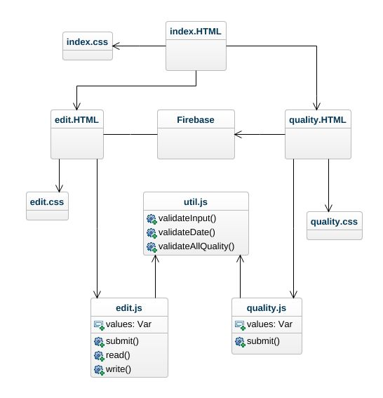

Developer Documentation
=======================

General Information
-------------------

-   RiverNET’s database is hosted by and links to Firebase.

Developer Tools
---------------

-   How to Obtain Stable Source code: Our source code can currently be found in
    the Git Repo linked below:

[Stable code](https://github.com/MichaelJHla/Rivernet)

-   Source Code: Our source code can be pulled for the git repository linked
    below:

[Developmental code](https://github.com/MichaelJHla/Rivernet/tree/dev)

-   Directory Layout: Our directory is layed out based on the current
    developments. The root directory contains some of the most important files
    for the structure of our webapp, prominently the package.json. The
    Documentation directory contains the User and Developer Documentation. The
    Src directory contains all of our source code, as well as tests on that
    code-stored within the Tests directory. There are two main branches on our
    Git Repo, a master branch which hosts our stable code and a dev branch that
    hosts our developmental code.

-   Class Diagram:

    Image of Our Basic Class Diagram

Building
--------

-   As of now, the Webapp runs as a standalone application (a node.js webapp)
    hosted on Firebase. It does not need to be built. If you wish to test the
    program on your local machine (with the help of node.js) you can run the
    following commands after cloning:

npm install //This only needs to be run once, the first time you are setting up
the project.

npm run build //This will build the modules into the /dist directory. The dist
directory is what the brower digests.

npm start //This command starts the express server on localhost:8080. On dev,
webpack-dev-middleware has been set up. Meaning that any change you make on your
machine and save, will be automatically sent to the server... All you have to do
is refresh! Navigate to: <http://localhost:8080/> to see the server.

-   However, that only means that on each new release we updated the hosted
    webapp on Firebase. Each release period when we are satisfied with our
    current Dev branch (or during steps along the way) we upload the project to
    the Firebase servers, updating the current website with our code. Usually,
    on each release we merge our dev branch with the master, to reflect our
    current stable release. This process requires a member of the inner team to
    complete, someone who has access to the Firebase project. Other test
    releases are welcome, but each one of these will require a fresh Firebase
    project and the code connecting each .js to Firebase will need to be updated
    with the new keys.

Testing
-------

-   How to Build: To build our tests ensure that the machine has Jest and JShint
    installed. These dependencies are listed in the package.json. The local
    machine requires the code linter JShint to run the basic tests and Jest to
    run Unit and Integration tests. The command to install JShint globally is:
    *npm install -g jshint*. The command to install Jest is: *npm install
    --save-dev jest*

-   How to Test: Tests can be run on local machines by running the command *npm
    test*. The tests will fail unless the local machine has installed the JSHint
    code linter and Jest. In order to use the installed (with npm install)
    version of jest you can run the command *./node_modules/.bin/jest
    --coverage* to run the jest testing suite with the additional coverage
    parameter.

-   Set up automated build & test: We set up Travis to automatically run the
    tests as a git push is fulfilled. Travis automatically runs tests every time
    the Github repo is pushed to. Within a work environment you can run *jest
    --watch* (or ./node_modules/.bin/jest --watch to use the npm installed
    version) to run tests on related code changes automatically. This is very
    handy as every time you change a function related with a test, that test is
    automatically ran again.

### Setting up automated Notifications

-   We set up automated messages for members of the team through travis-ci.
    Travis by default sends email notifications through Github to the committer
    if their push failed, but we also set up a process to email ALL members of
    the team if a build on Master branch fails, or a build changes from fail to
    success (is fixed). we did this with a simple travis command within the .yml
    (this one notifies everyone when a build is on master, success or fail):

notifications:

email:

~~~~~~~~~~~~~~~~~~~~~~~~~~~~~~~~~~~~~~~~~~~~~~~~~~~~~~~~~~~~~~~~~~~~~~~~~~~~~~~~
recipients:

  - email@mail.com

  - email@mail.com

if: branch = master

on_success: always # default: change

on_failure: always # default: always
~~~~~~~~~~~~~~~~~~~~~~~~~~~~~~~~~~~~~~~~~~~~~~~~~~~~~~~~~~~~~~~~~~~~~~~~~~~~~~~~

Version Control
---------------

-   Updating Revision Numbers: Revision numbers will be used as follows: v1.0
    for out first release after the beta and alpha releases. Afterwards, numbers
    will change by the tenths, v1.1, v1.2, etc. until a second version is ready
    to be released.

-   Create .zip files: You can create a .zip of our project from the Github home
    page, rather than cloning or forking, if desired.

-   Copying files to website: Mentioned above in building. We upload our code to
    the hosted server on Firebase on each release.

-   Sanity-checking: Sanity checking can be done by pushing changes to our
    developmental webapp, before releasing it on the official server.

    -   Link to developmental web application: [Dev Web
        App](https://dev-yerc-rivernet.firebaseapp.com/)

Bugs Reporting
--------------

-   How to access bug lists: To report a bug navigate to the *issues* section of
    the Github repo and create a new issue. Make sure to properly name the bug
    and describe exactly your issue before creating the issue. Ensure that the
    issue is also properly labeled, so that developers can easily determine what
    an issue is among the list of others. Currently, no user reported bug lists
    exist. Resolved and unresolved developer Issues can be viewed on Github.

-   Link to issues page:
    [Issues](https://github.com/MichaelJHla/Rivernet/issues)

Other Tools
-----------

-   Sprint meeting backlog link:
    [Backlog](https://docs.google.com/spreadsheets/d/1EpcOvnVprBMu9Vie981mnrZOXduwXx0HEIYXjy1ATHs/edit?usp=sharing)

-   Burndown Chart link:
    [Burndown](https://docs.google.com/spreadsheets/d/1lcPlu2pV-r7wStT2HD_ybs4AN_NLpjhi__2BIypfzw8/edit?usp=sharing)
